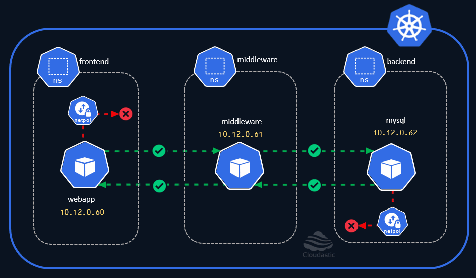

## Kubernetes Network Policies ##

**Introduction**

In this section, you will learn about, 
  * What are Kubernetes Network Policies
  * What challenge it addresses
  * What is CNI (Container Network Interface) and why its needed
  * Default network communication in Kubernetes
  * Anatomy of the Network Policy yaml definition
  * Network Policy types
      * Ingress
      * Egress
  * Fine-grained network isolation using Network policies.
  * Demo 
    * Deny all ingress traffic
    * Allow all ingress traffic
    * Deny all egress traffic
    * Allow all egress traffic
    * Deny all ingress and all egress traffic
    * Restrict communication for range of ports
    * Restrict communication on namespaces by label
  * Use-cases
  * Network Policy tips & tricks

All the explanations are covered with with a use-case scenario that helps gain deeper understanding of the concepts. 

We will start with basics and slowly work our way from the default kubernetes network communication and move towards applying the Network policies (case-by-case) with examples. 

Something from this., 

to this at the end.

  