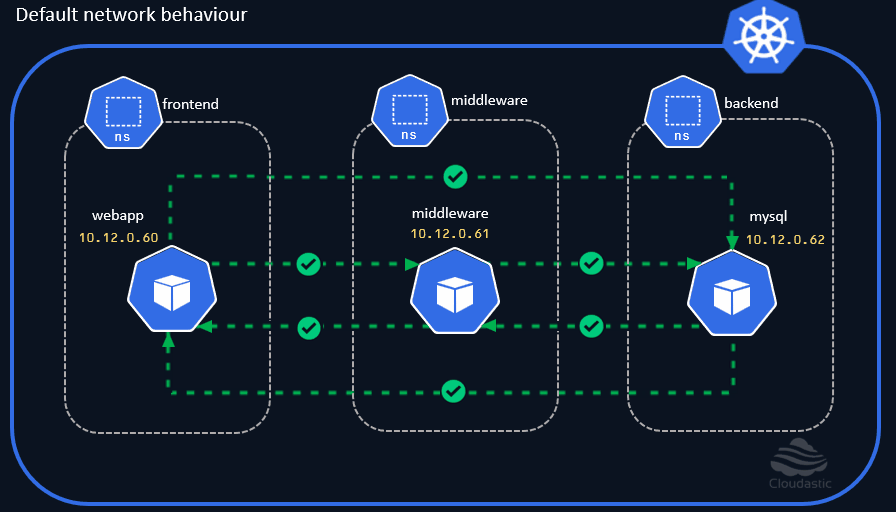

# Kubernetes Network Policies

**Introduction**
  01. What is Kubernetes Network Policies
  02. What challenge it addresses
  03. What is CNI (Container Network Interface) and why its needed
  04. Learning goals.

