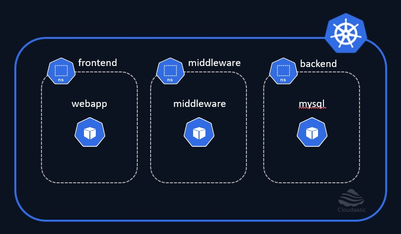

# Lab Set-up

For the purpose of this 'Kubernetes Network Policies' demo, We are leveraging the [killercoda](https://killercoda.com/cloudastic) to set-up the Lab and work through the exercises.

## Create resources ##

Now lets create the kubernetes resources as outlined in the diagram below,

[](./img/cluster-setup.jpg)

### Create Namespaces ###
```plain
kubectl create ns frontend
kubectl create ns middleware
kubectl create ns backend
```{{exec}}

### Create Pods
```sh
kubectl run webapp --image=nginx -n frontend
kubectl run middleware --image=nginx -n middleware
kubectl run mysql --image=nginx -n backend
```{{exec}}

### Update the default index page for ease of identification

Verify the resources that we have created,

```sh
until [ `kubectl get pods -A -o wide --field-selector=metadata.namespace!=kube-system,spec.nodeName!=controlplane | grep -w "Running" | wc -l` -eq 3 ] ; do
  echo "Wait until resources are being created"
  sleep 1
done
```{{exec}}

Lets verify if these pods are running,

```sh
kubectl get pods -A | grep -vE 'kube-system|local-path-storage'
```{{exec}}

Execute the below commands only after the pods are reporting 'Running' status. 

Update the default index page for ease of identification

In this step we are modifying the default index pages of the nginx for easy identification.

```sh
kubectl exec -it -n frontend webapp -- /bin/bash -c "echo Frontend > /usr/share/nginx/html/index.html"
```{{exec}}

```sh
kubectl exec -it -n middleware middleware -- /bin/bash -c "echo Middleware > /usr/share/nginx/html/index.html"
```{{exec}}

```sh
kubectl exec -it -n backend mysql -- /bin/bash -c "echo Backend > /usr/share/nginx/html/index.html"
```{{exec}}


