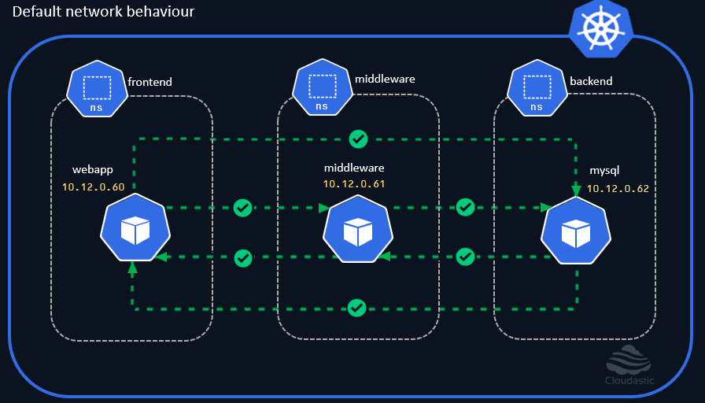
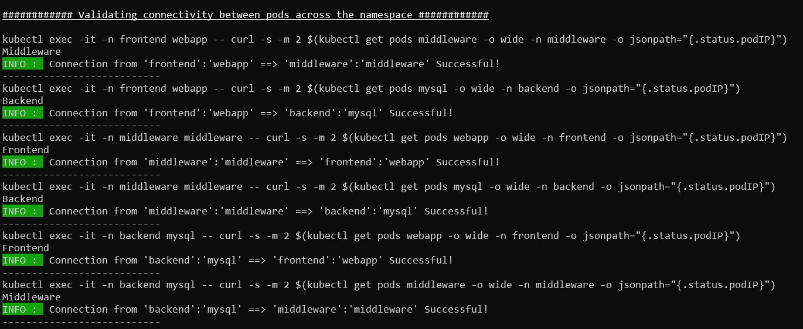

# Kubernetes default network behaviour

* Each Pod in the cluster gets a unique IP address.
* Containers within a pod share the same network namespace that includes the IP, Port and the MAC address. 
* A container within a multi-container pod can reach other containers within the pod through `localhost`.
* By default, All Inbound and Outbound connections are allowed for a Pod.

## default network communication across different Namespaces
[](./img/kubernetes-default-communication.gif)

## Demo

Now that we have already created the necessary resources, lets try to establish connection between different pods and see if that works.

## Check the IP Address of each pods
```plain
kubectl get pods -A -o wide --field-selector=metadata.namespace!=kube-system,spec.nodeName!=controlplane
```{{exec}}
Notice that each pods are assigned with a unique IP address. 

## Connect from webapp to middleware pod
```plain
kubectl exec -it -n frontend webapp -- curl $(kubectl get pods middleware -o wide -n middleware -o jsonpath="{.status.podIP}")
```{{exec}}

## Connect from webapp to mysql pod
```plain
kubectl exec -it -n frontend webapp -- curl $(kubectl get pods mysql -o wide -n backend -o jsonpath="{.status.podIP}")
```{{exec}}

## Connect from middleware to webapp pod
```plain
kubectl exec -it -n middleware middleware -- curl $(kubectl get pods webapp -o wide -n frontend -o jsonpath="{.status.podIP}")
```{{exec}}

## Connect from middleware to mysql pod
```plain
kubectl exec -it -n middleware middleware -- curl $(kubectl get pods mysql -o wide -n backend -o jsonpath="{.status.podIP}")
```{{exec}}

## Connect from mysql to middleware pod
```plain
kubectl exec -it -n backend mysql -- curl $(kubectl get pods middleware -o wide -n middleware -o jsonpath="{.status.podIP}")
```{{exec}}

## Connect from mysql to webapp pod
```plain
kubectl exec -it -n backend mysql -- curl $(kubectl get pods webapp -o wide -n frontend -o jsonpath="{.status.podIP}")
```{{exec}}

This demonstrates that we can establish connections between any pods in any namespaces across the entire cluster. The same is true even if all these pods co-exists in the same namespace or its spread across different nodes that form a cluster.

Note: 
Instead of running the `kubectl` commands several times to test the inbound and outbound connections, You could use this shell script [validate_connectivity.sh](./validate_connectivity.sh) that does the same, 

```bash
./validate_connectivity.sh
```{{exec}}

and produces output like this, 

[](./img/connectivity-check-script-output.jpg)

