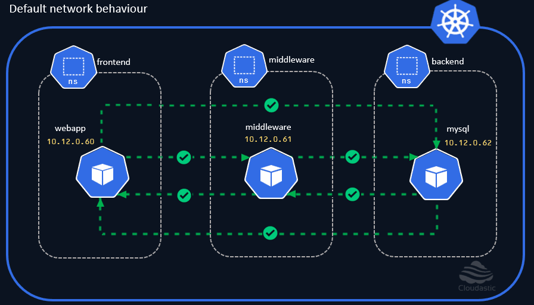

# Kubernetes default network behaviour

* Each Pod in the cluster gets a unique IP address.
* Containers within a pod share the same network namespace that includes the IP, Port and the MAC address. 
* A container within a multi-container pod can reach other containers within the pod through `localhost`.
* By default, All Inbound and Outbound connections are allowed for a Pod.

## default network communication within single Namespace
[](img/kubernetes-default-communication-single-ns.gif)

## default network communication across different Namespaces
[](img/kubernetes-default-communication.gif)

## Demo

Now that we have already created the necessary resources, lets try to establish connection between different pods and see if that works.

## Check the IP Address of each pods
```
kubectl get pods -A -o wide --field-selector=metadata.namespace!=kube-system
```
Notice that each pods are assigned with a unique IP address. 

## Connect from webapp to middleware pod
```
kubectl exec -it -n frontend webapp -- curl $(kubectl get pods middleware -o wide -n middleware -o jsonpath="{.status.podIP}")
```

## Connect from webapp to mysql pod
```
kubectl exec -it -n frontend webapp -- curl $(kubectl get pods mysql -o wide -n backend -o jsonpath="{.status.podIP}")
```

## Connect from middleware to webapp pod
```
kubectl exec -it -n middleware middleware -- curl $(kubectl get pods webapp -o wide -n frontend -o jsonpath="{.status.podIP}")
```

## Connect from middleware to mysql pod
```
kubectl exec -it -n middleware middleware -- curl $(kubectl get pods mysql -o wide -n backend -o jsonpath="{.status.podIP}")
```

## Connect from mysql to middleware pod
```
kubectl exec -it -n backend mysql -- curl $(kubectl get pods middleware -o wide -n middleware -o jsonpath="{.status.podIP}")
```

## Connect from mysql to webapp pod
```
kubectl exec -it -n backend mysql -- curl $(kubectl get pods webapp -o wide -n frontend -o jsonpath="{.status.podIP}")
```

This demonstrates that we can establish connections between any pods in any namespaces across the entire cluster. The same is true even if all these pods co-exists in the same namespace or its spread across different nodes that form a cluster.

Note: 
Instead of running the `kubectl` commands several times to test the inbound and outbound connections, You could use the below shell script that checks the connectivity and produces the output. 

```
#!/bin/bash

BOLD='\033[1m'
UL='\033[4m'
BG_RED='\033[41m'
BG_GREEN='\033[42m'
RESET='\033[0m'

array=("frontend:webapp:middleware:middleware" "frontend:webapp:backend:mysql" "middleware:middleware:frontend:webapp" "middleware:middleware:backend:mysql" "backend:mysql:frontend:webapp" "backend:mysql:middleware:middleware" )

echo -e "\n\n${BOLD}${UL}############ Validating connectivity between pods across the namespace ############${RESET}\n"
for element in "${array[@]}"; do
    IFS=':' read -r -a parts <<< "$element"

    echo "kubectl exec -it -n ${parts[0]} ${parts[1]} -- curl -s -m 2 \$(kubectl get pods ${parts[3]} -o wide -n ${parts[2]} -o jsonpath=\"{.status.podIP}\")"
    kubectl exec -it -n ${parts[0]} ${parts[1]} -- curl -s -m 2 $(kubectl get pods ${parts[3]} -o wide -n ${parts[2]} -o jsonpath="{.status.podIP}")
    if [ $? -eq 0 ]; then
    echo -e "${BG_GREEN}INFO : ${RESET} Connection from '${parts[0]}':'${parts[1]}' ==> '${parts[2]}':'${parts[3]}' Successful!"
        else
    echo -e "${BG_RED}ERROR : ${RESET} Connection from '${parts[0]}':'${parts[1]}' ==> '${parts[2]}':'${parts[3]}' failed."
        fi
    echo "---------------------------"
done
echo -e "\n\n"
```

It produces the output like this, 


[](img/connectivity-check-script-output.jpg)

