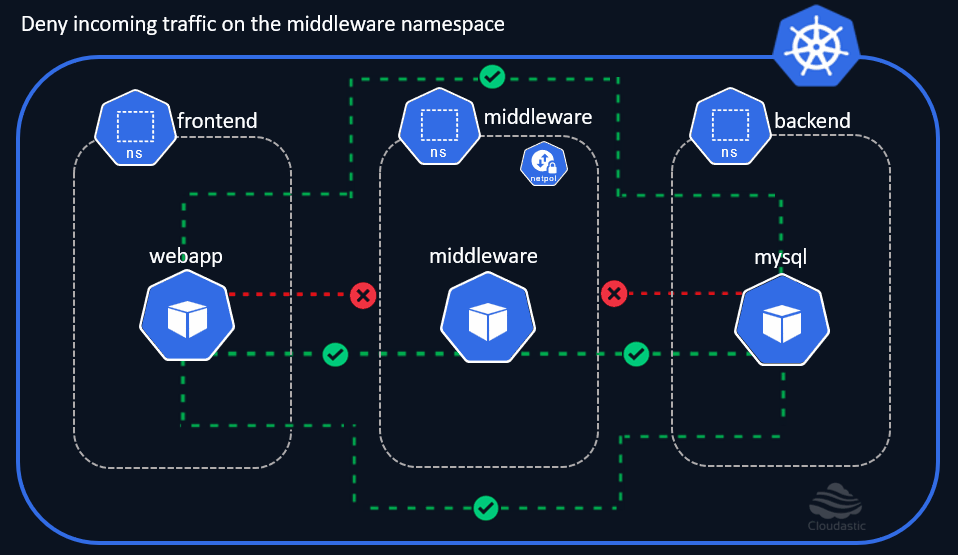

# Default deny all ingress traffic

## CNI Plugins
Before delving into the Network Policies in Kubernetes, we should briefly learn about the `CNI (Container Network Interface) Plugins`
* You need a `CNI Plugin` installed on the Cluster for the Network Policies to take effect. 
* There are '[several CNI Plugins](https://kubernetes.io/docs/concepts/cluster-administration/addons/#networking-and-network-policy)' available in the market, and all of them are supposed to implement the '[Kubernetes network model](https://kubernetes.io/docs/concepts/services-networking/#the-kubernetes-network-model)' but they differ in some aspects like support for varying networking needs, Performance, Security, Infrastrcture constraints and many more. 
* Various Cloud service providers like AWS, Azure, GCP and others have the CNI Plugins pre-installed by default. 


## Network Policies
* `Network Policies` are namespaced kubernetes resources. 
* They are used to control the flow of traffic between the pods and different network entities. 

## Demo

Let us now block all the incoming traffic 'ingress' to the middleware namespace.

[](img/deny-incoming-traffic-on-middleware-namespace-2.gif)

### Default deny all ingress for middleware namespace
```
cat <<EOF | kubectl create -n middleware -f -
apiVersion: networking.k8s.io/v1
kind: NetworkPolicy
metadata:
  name: default-deny-ingress
spec:
  podSelector: {}
  policyTypes:
  - Ingress
EOF
```

Now lets try to connect to the `middleware` pod from both the `webapp` and `mysql` pod.

## [Inbound connection] : Connect from webapp to middleware pod
```
kubectl exec -it -n frontend webapp -- curl -m 3 $(kubectl get pods middleware -o wide -n middleware -o jsonpath="{.status.podIP}")
```

## [Inbound connection] : Connect from mysql to middleware pod
```
kubectl exec -it -n backend mysql -- curl -m 3 $(kubectl get pods middleware -o wide -n middleware -o jsonpath="{.status.podIP}")
```

Both the ingress requests have now timed out, clearly indicating that incoming traffic to the `middleware` namespace is blocked. Let us now try to establish outbound connection from the `middleware` pod to other pods in `frontend` and `backend` namespace.


## [Outbound connection] : Connect from middleware to webapp pod
```
kubectl exec -it -n middleware middleware -- curl -m 3 $(kubectl get pods webapp -o wide -n frontend -o jsonpath="{.status.podIP}")
```

## [Outbound connection] : Connect from middleware to mysql pod
```
kubectl exec -it -n middleware middleware -- curl -m 3 $(kubectl get pods mysql -o wide -n backend -o jsonpath="{.status.podIP}")
```

## Use-cases:

* Network isolation could be done either through blacklisting / whitelisting approach. 
* The `default deny` policies are used as a best practice to knock down all the communications in first place., and then adding the whitelist on top of it. 
* Network policies do not conflict., they are additive. Hence it will perform a 'UNION' or 'Logical OR' operation, hence the order of evaluation doesn’t matter. 


Well!, the outbound connections from the `middleware` pod is working without any issues. 
How do we restrict the Outbound connections then ? 
Its done through the Network Policy with the policy type 'egress'.