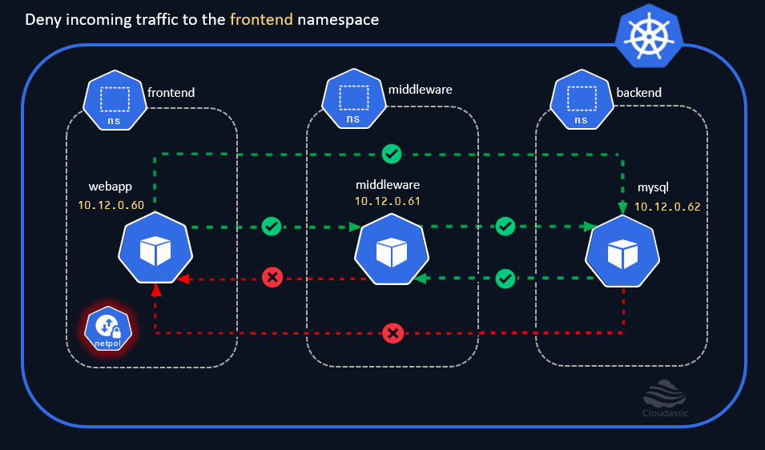
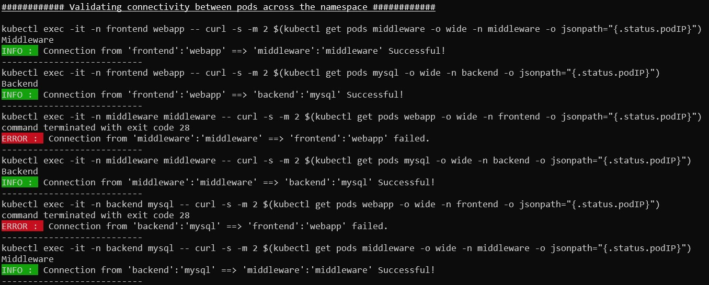

# Deny ingress on frontend namespace

## CNI Plugins
Before delving into the Network Policies in Kubernetes, we should briefly learn about the `CNI (Container Network Interface) Plugins`
* You need a `CNI Plugin` installed on the Cluster for the Network Policies to take effect. 
* There are [several CNI Plugins](https://kubernetes.io/docs/concepts/cluster-administration/addons/#networking-and-network-policy) available in the market, and all of them are supposed to implement the [Kubernetes network model](https://kubernetes.io/docs/concepts/services-networking/#the-kubernetes-network-model) but they differ in some aspects like support for varying networking needs, Performance, Security, Infrastrcture constraints and many more. 


## Network Policies
* `Network Policies` are namespaced kubernetes resources. 
* They are used to control the flow of traffic between the pods and different network entities. 

## Demo
* We know that, by-default all the pods in a cluster can freely communicate with other pods without any restriction. 
* By the end of the exercise, our goal is to ensure that the  `webapp` pod in the `frontend` namespace should communicate with the `mysql` pod in the `backend` namespace only through the `middelware` pod in the `middleware` namespace. 
* Similarly, the `mysql` pod in the `backend` namespace should only communicate with the `webapp` pod in the `frontend` namespace only through the `middleware` pod in the `middleware` namespace. All the other communications should be restricted. 
* Before diving into the desired outcome, we'll explore a few more concepts and use cases to build a deeper understanding as we progress.

Let us now block all the incoming traffic 'ingress' to the `frontend` namespace.

[](img/deny-incoming-traffic-to-frontend-namespace.gif.gif)

### Deny all ingress traffic to frontend namespace
```yaml
cat <<EOF | kubectl create -n frontend -f -
apiVersion: networking.k8s.io/v1
kind: NetworkPolicy
metadata:
  name: default-deny-ingress
spec:
  podSelector: {}
  policyTypes:
  - Ingress
EOF
```

Now lets try to connect to the `frontend` pod from both the `middleware` and `mysql` pod.

## Test Ingress to `frontend` namespace
```sh
# Test Ingress from 'middleware' to 'webapp' pod
kubectl exec -it -n middleware middleware -- curl -m 3 $(kubectl get pods webapp -o wide -n frontend -o jsonpath="{.status.podIP}")

# Test Ingress from 'mysql' to 'webapp' pod
kubectl exec -it -n backend mysql -- curl -m 3 $(kubectl get pods webapp -o wide -n frontend -o jsonpath="{.status.podIP}")
```

Both the ingress requests have now timed out, clearly indicating that incoming traffic to the `frontend` namespace is blocked. Let us now try to establish outbound connection from the `webapp` pod in the `frontend` namespace to other pods in `middleware` and `backend` namespace.


## Test Egress from `frontend` namespace
```sh
# Test Egress from 'webapp' to 'middleware' pod
kubectl exec -it -n frontend webapp -- curl -m 3 $(kubectl get pods middleware -o wide -n middleware -o jsonpath="{.status.podIP}")

# Test Egress from 'webapp' to 'mysql' pod
kubectl exec -it -n frontend webapp -- curl -m 3 $(kubectl get pods mysql -o wide -n backend -o jsonpath="{.status.podIP}")

```

Alternatively, use our shell script to quickly check the same,

[](img/connectivity-check-deny-ingress-to-frontend-ns.jpg)


Well, the outbound connections from the `frontend` pod is working without any issues. 
How do we restrict the Outbound connections then ? 
Its done through the Network Policy with the policy type set to 'egress'.


## Use-cases:

* Network isolation could be done either through blacklisting / whitelisting approach. 
* The `default deny` policies are used as a best practice to knock down all the communications in first place. Once this baselining is applied, you can then add the whitelist on top of it to create exceptions. This way, you block everything first and then allow only those trusted connections. 
* Network Policies should be a key component of Kubernetes cluster security, but they are not the silver bullet since they don't offer deep traffic inspection like an enterprise-grade firewall. However, by enabling only trusted connections between resources, you effectively reduce the attack surface of the cluster.


