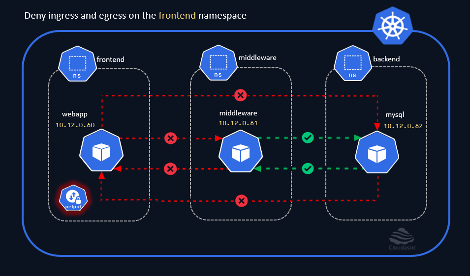

# Deny egress on frontend namespace

### Deny all egress traffic from frontend namespace
```
cat <<EOF | kubectl create -n frontend -f -
apiVersion: networking.k8s.io/v1
kind: NetworkPolicy
metadata:
  name: default-deny-egress
spec:
  podSelector: {}
  policyTypes:
  - Egress
EOF
```


[](img/deny-ingress-egress-on-frontend-ns.gif)