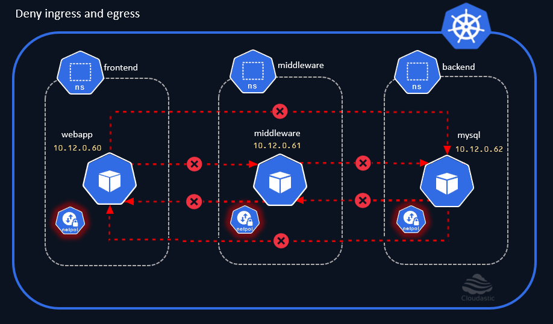
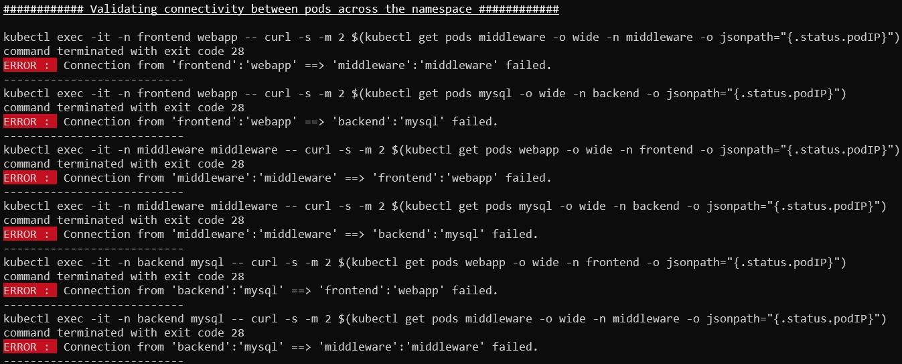

# Deny ingress and egress

In our last demo, We have applied two different network policies. One to restrict the incoming traffic and the other one to restrict the outbound traffic in the `frontend` namespace. 

The same could be accomplished using a single network policy to restrict both the ingress and egress. In this demo, we will restrict the all the inbound and outbound traffic for the `middleware` and `backend` namespaces.

[](img/deny-ingress-and-egress.gif)

### Deny both ingress and egress on middleware namespace
```
cat <<EOF | kubectl create -n middleware -f -
apiVersion: networking.k8s.io/v1
kind: NetworkPolicy
metadata:
  name: default-deny
spec:
  podSelector: {}
  policyTypes:
  - Ingress
  - Egress
EOF
```

### Deny both ingress and egress on backend namespace
```
cat <<EOF | kubectl create -n backend -f -
apiVersion: networking.k8s.io/v1
kind: NetworkPolicy
metadata:
  name: default-deny
spec:
  podSelector: {}
  policyTypes:
  - Ingress
  - Egress
EOF
```

Verify if the Network Policies are created
```
kubectl get netpol default-deny -n middleware

kubectl describe netpol default-deny -n middleware

kubectl get netpol default-deny -n backend

kubectl describe netpol default-deny -n backend
```

Whilst describing the NetworkPolicy, notice that the Policy type reflects both the `Policy Types: Ingress, Egress`. 

Let's test the connectivity between the pods across all these namespaces, (Since we have already verified this for the `frontend` namespace, let us validate it only for the `middleware` and `backend` namespace. )

## Test Egress from frontend namespace

```
# Test Egress from 'middleware' to 'backend' pod
kubectl exec -it -n middleware middleware -- curl -m 3 $(kubectl get pods mysql -o wide -n backend -o jsonpath="{.status.podIP}")

# Test Egress from 'mysql' to 'middleware' pod
kubectl exec -it -n backend mysql -- curl -m 3 $(kubectl get pods middleware -o wide -n middleware -o jsonpath="{.status.podIP}")

```

We have now restricted both the `ingress` and `egress` traffic across all these namespaces. 

[](img/connectivity-check-deny-ingress-and-egress.jpg)


