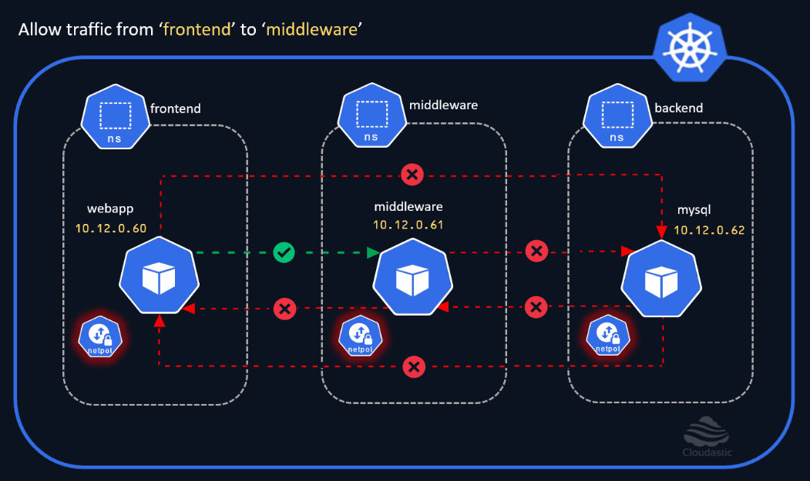
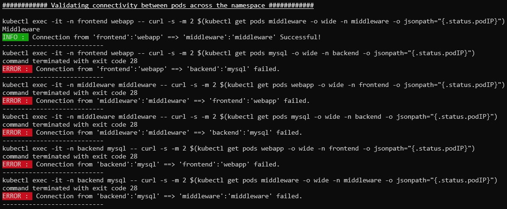

# Allow "frontend ==> middleware" communication

In the earlier section, we have applied the `default deny` network policies on all the namespaces restricting both the inbound and outbound traffic. Now let us enable the `webapp` pod in the `frontend` namespace to talk to the `middleware` pod in the `middleware` namespace. 

[](img/allow-frontend-to-middleware.gif)

### Allow Ingress from middleware to frontend
```
cat <<EOF | kubectl create -n middleware -f -
apiVersion: networking.k8s.io/v1
kind: NetworkPolicy
metadata:
  name: mw-to-fe-allow-ingress
spec:
  podSelector: 
    matchLabels:
      run: middleware
  ingress:
    - from:
      - namespaceSelector:
          matchLabels:
            kubernetes.io/metadata.name: frontend
        podSelector: 
          matchLabels:
            run: webapp
EOF
```

### Allow Egress from frontend to middleware
```
cat <<EOF | kubectl create -n frontend -f -
apiVersion: networking.k8s.io/v1
kind: NetworkPolicy
metadata:
  name: fe-to-mw-allow-egress
spec:
  podSelector: 
    matchLabels:
      run: webapp
  egress:
    - to:
      - namespaceSelector: 
          matchLabels:
            kubernetes.io/metadata.name: middleware	  
        podSelector:
          matchLabels:
            run: middleware
EOF
```

Note: We need to enable the `ingress` on the middleware and the `egress` on the frontend namespace to allow the communication to happen. 

Lets validate the connectivity. 

[](img/connectivity-check-middleware-to-frontend-ns.jpg)


