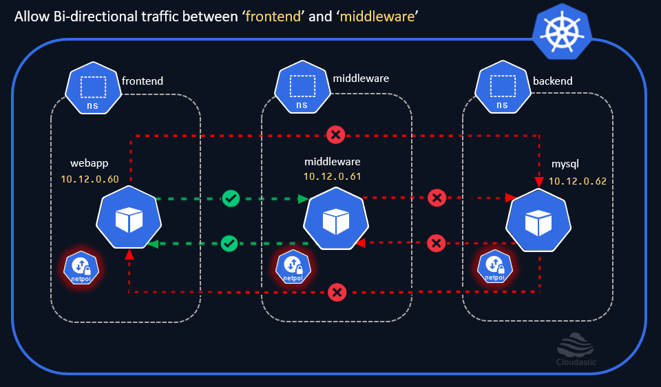
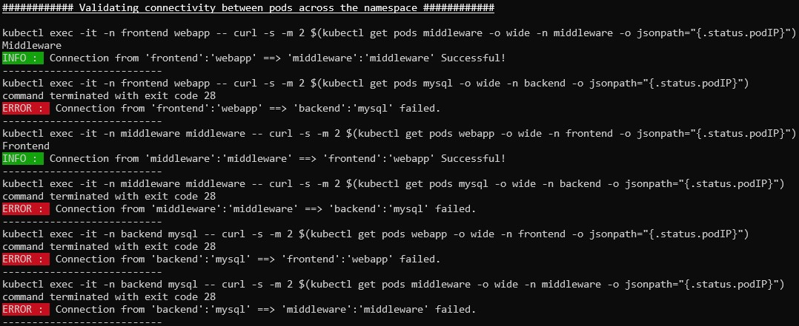

# Allow "frontend <==> middleware" communication

In the earlier section, have enabled oneway traffic by letting the `webapp` pod in the `frontend` namespace communicate with the `middleware` pod in the `middleware` namespace. In this chapter, we will enable the Inbound and the Outbound traffic to and from the `middleware` namespace to the `webapp` pod in the `frontend` namespace. 

We can simplify the process futher by combining the `ingress` and `egress` rules into a single Network policy. Let's delete the network policies that we have created earlier and apply these new simplified policies. 

[](img/allow-bidirectional-traffic-between-frontend-and-middleware.gif)

### Delete the Network Policies created in the previous chapter
```sh
kubectl delete netpol -n middleware mw-to-fe-allow-ingress
kubectl delete netpol -n frontend fe-to-mw-allow-egress
```

### Allow Ingress & Egress on middleware to frontend
```yaml
cat <<EOF | kubectl create -n middleware -f -
apiVersion: networking.k8s.io/v1
kind: NetworkPolicy
metadata:
  name: mw-to-fe-allow-ingress-and-egress
spec:
  podSelector: 
    matchLabels:
      run: middleware
  ingress:
    - from:
      - namespaceSelector:
          matchLabels:
            kubernetes.io/metadata.name: frontend
        podSelector: 
          matchLabels:
            run: webapp
  egress:
    - to:
      - namespaceSelector:
          matchLabels:
            kubernetes.io/metadata.name: frontend
        podSelector: 
          matchLabels:
            run: webapp
EOF
```

### Allow Ingress & Egress on frontend to middleware

```yaml
cat <<EOF | kubectl create -n frontend -f -
apiVersion: networking.k8s.io/v1
kind: NetworkPolicy
metadata:
  name: fe-to-mw-allow-egress-and-egress
spec:
  podSelector: 
    matchLabels:
      run: webapp
  egress:
    - to:
      - namespaceSelector: 
          matchLabels:
            kubernetes.io/metadata.name: middleware	  
        podSelector:
          matchLabels:
            run: middleware
  ingress:
    - from:
      - namespaceSelector:
          matchLabels:
            kubernetes.io/metadata.name: middleware
        podSelector: 
          matchLabels:
            run: middleware
EOF
```

We have combined both the `ingress` and the `egress` rules in a single Network policy and applied the same on both the namespaces. 

[](img/connectivity-check-frontend-and-middleware.jpg)

We could now see the Bi-directional traffic flow between the `frontend` and the `middleware` namespace restricted only to the `webapp` and the `middleware` pods.


