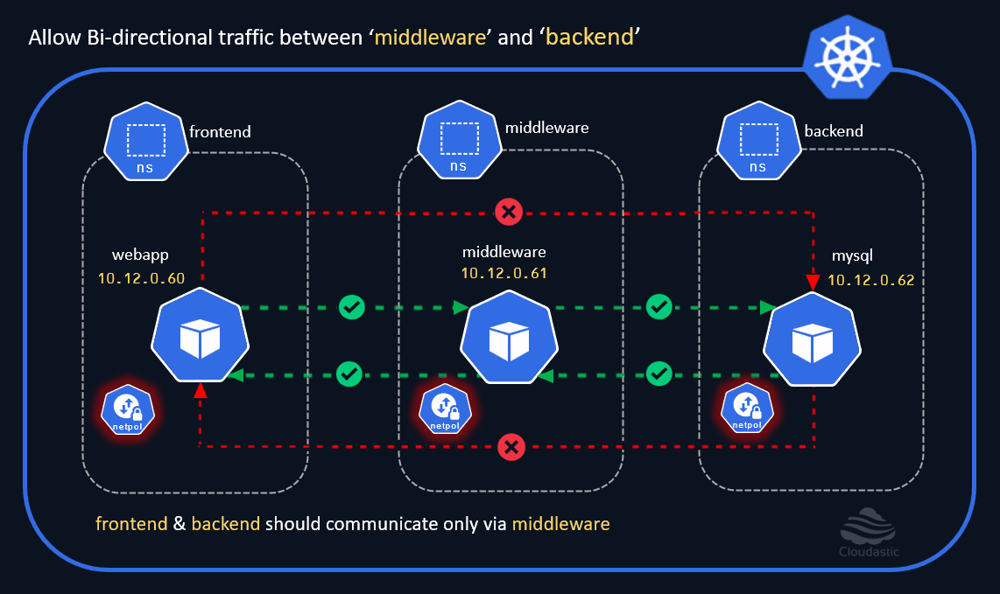
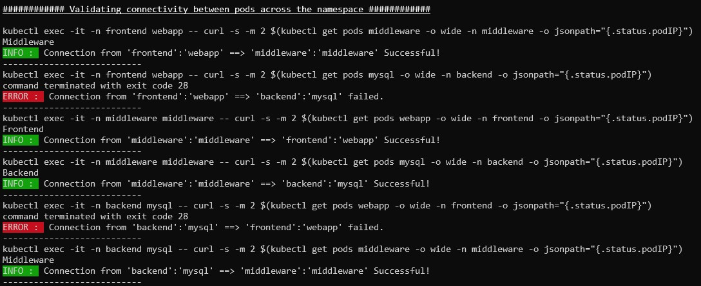

# Allow "backend <==> middleware" communication

In the earlier section, we have successfully enabled the communication between the `frontend` and the `middleware` namespace. In this section, we will create the Network Policies to enable the Bi-Directional communication between the `middleware` and the `backend` namespace., there by only allowing the `middleware` pod to talk to the `mysql` pod and vice-versa. By applying this policy, We 

[](img/allow-middleware-to-backend.gif)

### Allow Ingress from middleware to frontend
```yaml
cat <<EOF | kubectl create -n middleware -f -
apiVersion: networking.k8s.io/v1
kind: NetworkPolicy
metadata:
  name: mw-to-fe-allow-ingress
spec:
  podSelector: 
    matchLabels:
      run: middleware
  ingress:
    - from:
      - namespaceSelector:
          matchLabels:
            kubernetes.io/metadata.name: frontend
        podSelector: 
          matchLabels:
            run: webapp
EOF
```

### Allow Egress from frontend to middleware
```
cat <<EOF | kubectl create -n frontend -f -
apiVersion: networking.k8s.io/v1
kind: NetworkPolicy
metadata:
  name: fe-to-mw-allow-egress
spec:
  podSelector: 
    matchLabels:
      run: webapp
  egress:
    - to:
      - namespaceSelector: 
          matchLabels:
            kubernetes.io/metadata.name: middleware	  
        podSelector:
          matchLabels:
            run: middleware
EOF
```

Note: We need to enable the `ingress` on the middleware and the `egress` on the frontend namespace to allow the communication to happen. 

Lets validate the connectivity. 

[](img/connectivity-check-middleware-and-backend.jpg)


