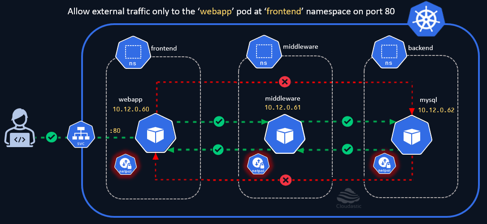

# Allow External user access

Let us now allow external users to access the webapp pod in the frontend namespace by exposing it through a NodePort service. While doing that, we will learn about adding multiple network policy rules and allowing access to IP Range and specific ports. 

[](img/allow-external-user-access-via-nodeport-svc.gif)


### Create NodePort Service to expose Webapp pod
```yaml
cat <<EOF | kubectl create -n frontend -f -
apiVersion: v1
kind: Service
metadata:
  name: frontend-svc
spec:
  selector:
    run: webapp
  ports:
    - protocol: TCP
      port: 80          # Expose port 80 on the Service
      targetPort: 80    # Port on the pod that the service will forward to
      nodePort: 30080   # Expose the service on this node port externally
  type: NodePort        # set NodePort type to make the service accessible externally
EOF
```

### Verify the NdoePort service

```yaml
kubectl get svc -n frontend
```

Now let us access the NodePort service to check if the service is accessible.
Note: `minikube ip` command will provide the node IP address that you could use to access the Nodeport service.

```sh
curl http://$(minikube ip):30080
```

Well the connection didn't work. Is that expected ? Yes
Why ?  Because we do have a default deny network policy restrict the traffic and that needs to be tweaked to allow access. We can achieve it by modifying the `fe-to-mw-allow-egress-and-ingress` Network policy on the `frontend` namespace. We need to amend another ingress rule to this policy to make it work. 

### Amend another Ingress rule to the existing Policy to allow traffic

``` yaml
  - from:
    - ipBlock:
        cidr: 0.0.0.0/0  # Allow access from any IP address
    ports:
      - protocol: TCP
        port: 80 
```

Once the changes are made, the resulting network policy should look like below,

```yaml
apiVersion: networking.k8s.io/v1
kind: NetworkPolicy
metadata:
  name: fe-to-mw-allow-ingress-and-egress
  namespace: frontend
spec:
  egress:
  - to:
    - namespaceSelector:
        matchLabels:
          kubernetes.io/metadata.name: middleware
      podSelector:
        matchLabels:
          run: middleware
  ingress:
  - from:
    - namespaceSelector:
        matchLabels:
          kubernetes.io/metadata.name: middleware
      podSelector:
        matchLabels:
          run: middleware
  - from:
    - ipBlock:
        cidr: 0.0.0.0/0  # Allow access from any IP address
    ports:
      - protocol: TCP
        port: 80  # Expose port 80 (NodePort)
  podSelector:
    matchLabels:
      run: webapp
  policyTypes:
  - Ingress
  - Egress
```

Now try and access the NodePort service using the command `curl http://$(minikube ip):30080` and notice the connection works. 
