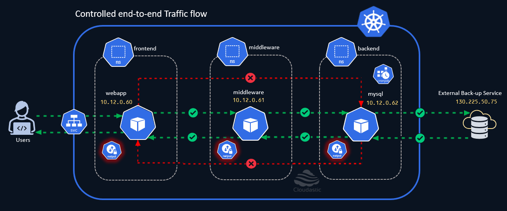

# Allow External Traffic

Imagine a use-case, where we have a requirement to allow an External service to periodically take back-up of the database. <br>
This could be done in multiple ways., however the focus here is about tweaking the network policy to enable connectivity to the external service, so that it could perform the backup.

[](./img/controlled-end-to-end-flow.gif)

As a pre-requisite you should already know the IP address of the external system that you want to whitelist / allow. <br>
In this demo, We will be simulating this use-case by making use of a weather forecast website (https://wttr.in) and try the connectivity from the mysql pod in the backend namsepace. <br>
Reaching the website (https://wttr.in) from the `mysql` pod in `backend` namespace and receiving a response confirms that our network policy is working as expected. 

### Connection check before tweaking the Network Policy

Execute the below command tp grab the IP address of the external weather service,

```bash
echo "IP Address : "$(dig +short wttr.in | grep -E '^[0-9.]+$' | head -n 1)
```{{exec}}
<br>
Make a note of this IP address and replace it in `to.ipBlock.cidr` section of the yaml while modifying the network policy.<br>

Before we tweak the Network policy, Let us quickly make a connection to see how it behaves now, 

```bash
ip_address=$(dig +short wttr.in | grep -E '^[0-9.]+$' | head -n 1)
kubectl exec -it -n backend mysql -- curl -s -m 2 http://$ip_address
```{{exec}}

You might have noticed that the connection is not working due to the restriction we already have in place.

### Modify existing Network Policy

Use kubectl to modify the existing policy `be-to-mw-allow-ingress-and-egress` in the backend namespace,

```bash
kubectl edit netpol -n backend be-to-mw-allow-ingress-and-egress
```{{exec}}

### Amend another Egress rule to the existing Policy to allow traffic

``` yaml
  - to:
    - ipBlock:
        cidr: 5.9.243.187/32  # Replace the IP Address here
    ports:
    - protocol: TCP
      port: 80               # Port number used at the Back-up service for communication
```

Once the changes are made, the resulting network policy should look like below,

``` yaml
apiVersion: networking.k8s.io/v1
kind: NetworkPolicy
metadata:
  name: be-to-mw-allow-ingress-and-egress
  namespace: backend
spec:
  egress:
  - to:
    - namespaceSelector:
        matchLabels:
          kubernetes.io/metadata.name: middleware
      podSelector:
        matchLabels:
          run: middleware
  - to:
    - ipBlock:
        cidr: 5.9.243.187/32 # Replace the IP Address here
    ports:
    - protocol: TCP
      port: 80  # Port number used at the Back-up service for communication
  ingress:
  - from:
    - namespaceSelector:
        matchLabels:
          kubernetes.io/metadata.name: middleware
      podSelector:
        matchLabels:
          run: middleware
  podSelector:
    matchLabels:
      run: mysql
  policyTypes:
  - Ingress
  - Egress
```{{exec}}

Now, Let us make the connection once again to check the result of the changes,

```bash
ip_address=$(dig +short wttr.in | grep -E '^[0-9.]+$' | head -n 1)
kubectl exec -it -n backend mysql -- curl -s -m 2 http://$ip_address
```{{exec}}

<br><br>
You should see a weather forecast if the policy applied is working as desired. 


